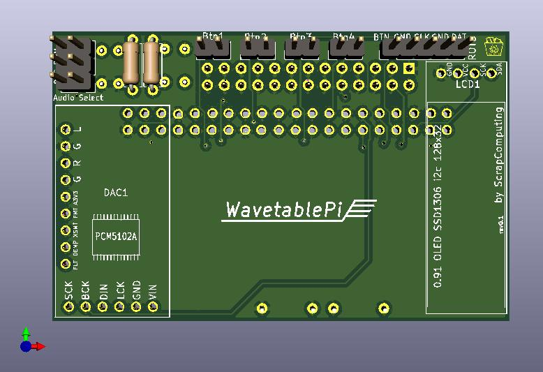
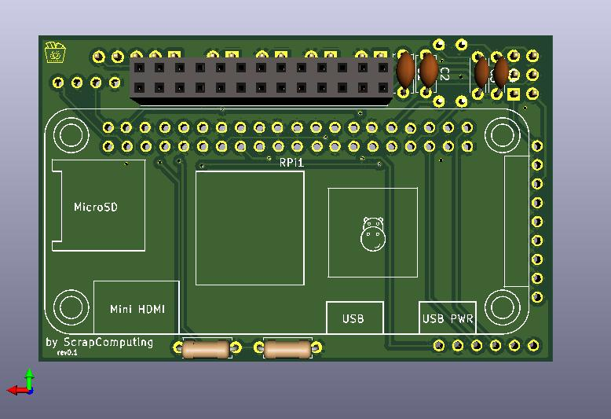
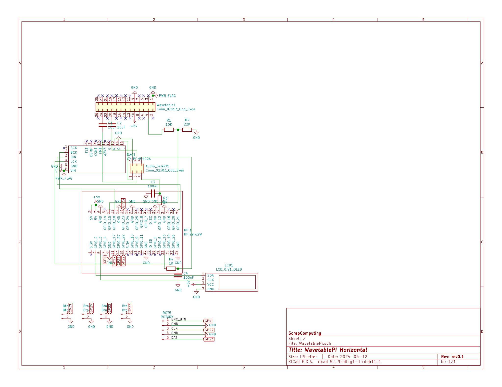

# Horizontal WavetablePi

This is the horizontal version of [WavetablePi](https://github.com/scrapcomputing/WavetablePi).
It is a wavetable module based on the Raspberry Pi Zero 2 W running [mt32-pi](https://github.com/dwhinham/mt32-pi).
It is capable of emulating several midi synthesizers, including mt32, sc55 and general midi with custom sound fonts.
For a complete feature list please refer to the [mt32-pi](https://github.com/dwhinham/mt32-pi) project.

An assembly guide can be found [here](assembly.md).

- 5.25 drive bay faceplates (by Michael Swimm) https://www.thingiverse.com/thing:6652143

# New Features
- This version also includes headers for the mt32-pi buttons and rotary encoder.

# Bill of materials

The gerber can be found in the [releases](https://github.com/scrapcomputing/WavetablePiHoriz/releases)

Item                                     | #   | Description
-----------------------------------------|-----|-----------------------------------------
Raspberry Pi Zero 2 W                    | 1   | The older RPi Zero is not fast enough
40-pin 2x20 male header 2.54mm pitch     | 1   | For attaching the RPi to the board.
26-pin 2x13 female header 2.54mm pitch   | 1   | For attaching the board to the wavetable header
6-pin 2x3 pin male header 2.54mm pitch   | 1   | For the audio select jumpers
2-pin 1x2 pin male header 2.54mm pitch   | 4   | (Optional) Headers for mt32-pi buttons
5-pin 1x5 pin male header 2.54mm pitch   | 1   | (Optional) Header for mt32-pi rotary encoder
Jumper 2.54mm pitch                      | 2   | Jumpers for the audio selection header
Capacitor 10uF through-hole ceramic      | 2   |
Capacitor 100nF through-hole ceramic     | 2   | C3 and C4 which form the PWM audio low-pass filter along with R3 and R4. 100nF is for a 1.6KHz cutoff frequency. Use lower values for higher cutoff
Resistor 22K Ohm                         | 1   |
Resistor 10K Ohm                         | 1   |
Resistor 1K Ohm                          | 2   | R3 and R4, which along with C3 and C4 form a low-pass filter of the PWM audio
0.91 OLED SSD1306 I2C 128x32 module      | 1   | (Optional)
PCM5102A I2S DAC Module (aka GY PCM5120) | 1   | (Optional but highly recommended) Please check the PCB for the supported dimensions and form factor!

