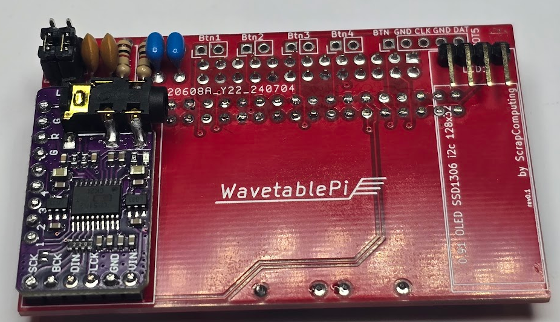
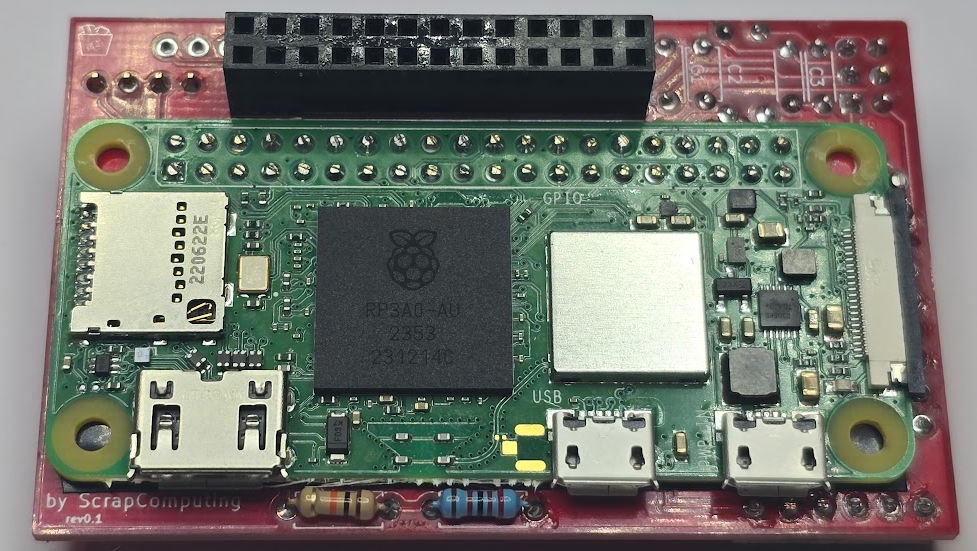
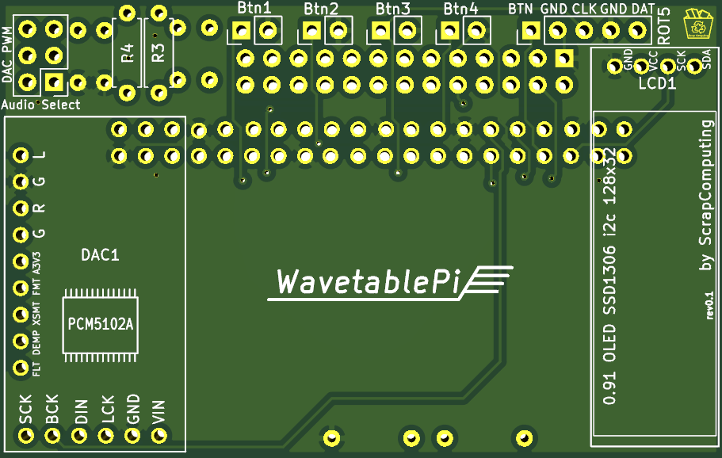
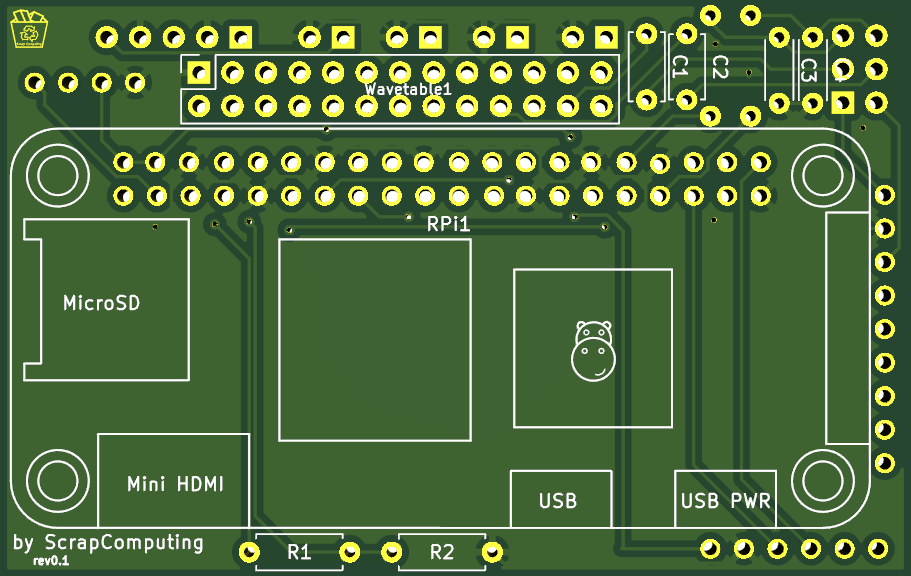
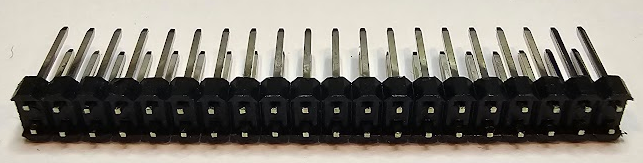
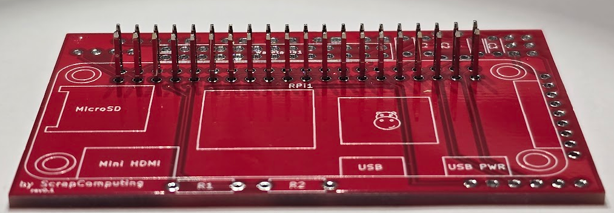

# Assembling the Horizontal WavetablePi

An idiot's guide to assembling the Horizontal WavetablePi by @sweetlilmre

## Introduction

I found assembling this board quite tricky, especially in terms of the order of operations and made several errors on my first attempt. I hope this guide will help you avoid the same mistakes I made.

## Front side assembly

### Front side assembly steps:

- Solder resistors R3 and R4 (1K Ohm) as shown
- Capacitors C1 - C4 have silk screen markings on the back of the board. Solder them on the front side of the board instead to provide extra clearance around the Wavetable header. On this side:
  - Capacitors C3 and C4 100nF: left of R4, R3
  - Capacitors C1 and C2 10uF: right of R4, R3
- If you are using the optional DAC module:
    - Place the pins into the holes.
    - Place the DAC onto the pins to align the pins properly.
    - Solder the header pins to the back side of the board.
    - Do *not* solder the DAC module yet.
  - Clip the pins flush on the back side of the board.
- Solder the Audio Select header.
- Solder the optional headers as required.
  - **NOTE**: I would suggest using right angled pin headers to reduce overall component height on this side e.g. LCD header pins facing down, Btn1 - Btn4 and ROT5 pin facing up.

## Back side assembly

### Back side assembly steps:

- Solder resistors R1 (10K Ohm) and R2 (22K Ohm) as shown.
- Soldering the Pi:
  - We will solder the Pi flush to the board:
    - Mask off the area that will be between the Pi and the board with tape to prevent any potential shorts / issues. Kapton tape or even elecrical tape will do.
  - Soldering the 40-pin header and removing the plastic spacer can be tricky:
    - Push the plastic spacer of the 40 pin header down the pins, using a hard flat surface to make sure all pins are aligned:
    
    - Push the header through the holes on the front of the board:
    
    - Place the Pi on top of the header pins, push the Pi down against the board and solder the pins to the Pi.
    - Trim the pins on the Pi side of the board and flip the board over.
    - Working from one end, pry up the plastic spacer and remove it (it may help to use a cutting tool to separate the spacer every 3 or 4 sets of pins).
    - Solder the pins to the board on the front side.
    - Trim the pins.
- Flip the board back over, place and then solder the Wavetable header.

## Final assembly

If you are using the DAC module:
- ensure that the jumpers on the DAC are configured according to [this guide](https://github.com/dwhinham/mt32-pi/wiki/GY-PCM5102-DAC-module) before soldering the DAC to the board.

- Solder the DAC module to the board.

Set the jumpers on the Audio Select header to the desired configuration.

